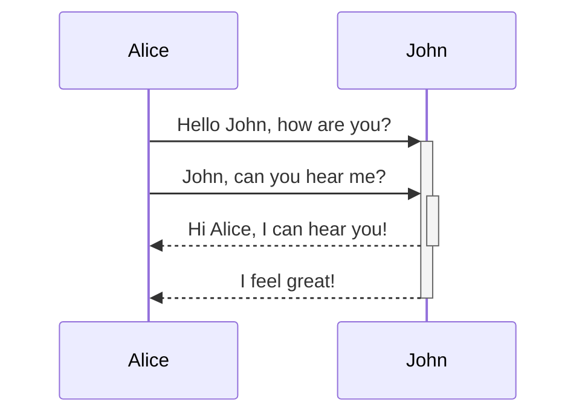
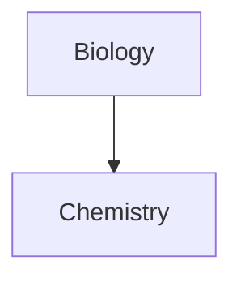

Aprende a añadir una sintaxis de formato avanzada a tus notas.

## Tablas
---
Puedes crear tablas usando barras verticales () para separar columnas y guiones () para definir cabeceras. Aquí tienes un ejemplo:`|``-`

```md
| First name | Last name |
| ---------- | --------- |
| Max        | Planck    |
| Marie      | Curie     |
```

| Nombre de pila | Apellido |
| -------------- | -------- |
| Máximo         | Planck   |
| Marie          | Curie    |

Aunque las barras verticales a ambos lados de la mesa son opcionales, se recomienda incluirlas para facilitar la legibilidad.

>[!tip] En _la vista previa en directo_, puedes hacer clic derecho en una tabla para añadir o eliminar columnas y filas. También puedes ordenarlas y moverlas usando el menú contextual.

Puedes insertar una tabla usando el comando **Insertar tabla** desde la [Paleta de Comandos](https://help.obsidian.md/plugins/command-palette) o haciendo clic derecho y seleccionando _Insertar → Tabla_. Esto te dará una tabla básica y editable:

```md
|     |     |
| --- | --- |
|     |     |
```

Ten en cuenta que las celdas no necesitan alineación perfecta, pero la fila principal debe contener al menos dos guiones:

```md
First name | Last name
-- | --
Max | Planck
Marie | Curie
```

### Formato contenido dentro de una tabla 
---
Puedes usar [la sintaxis básica de formato](https://help.obsidian.md/syntax) para estilizar contenido dentro de una tabla.

| Primera columna                                       | Segunda columna                                                                                                    |
| ----------------------------------------------------- | ------------------------------------------------------------------------------------------------------------------ |
| [Enlaces internos](https://help.obsidian.md/links)    | Enlace a un archivo _dentro_ de tu **bóveda**.                                                                     |
| [Incrustar archivos](https://help.obsidian.md/embeds) |  |

Barras verticales en tablas

Si quieres usar [alias](https://help.obsidian.md/aliases) o [redimensionar una imagen](https://help.obsidian.md/syntax#External%20images) en tu tabla, tienes que añadir una a antes de la barra vertical.`\`

```md
First column | Second column
-- | --
[[Basic formatting syntax\|Markdown syntax]] | ![[Engelbart.jpg\|200]]
```

| Primera columna                                      | Segunda columna                                                                                                    |
| ---------------------------------------------------- | ------------------------------------------------------------------------------------------------------------------ |
| [Sintaxis Markdown](https://help.obsidian.md/syntax) |  |

Alinea el texto en columnas añadiendo dos puntos () a la fila de cabecera. También puedes alinear el contenido en _la Vista previa en directo_ a través del menú contextual.`:`

```md
Left-aligned text | Center-aligned text | Right-aligned text
:-- | :--: | --:
Content | Content | Content
```

| Texto alineado a la izquierda | Texto alineado al centro | Texto alineado a la derecha |
| :---------------------------- | :----------------------: | --------------------------: |
| Contenido                     |        Contenido         |                   Contenido |

## Diagrama
---
Puedes añadir diagramas y gráficos a tus notas, usando [la sirena](https://mermaid-js.github.io/). Sirena soporta una variedad de diagramas, como [diagramas de flujo](https://mermaid.js.org/syntax/flowchart.html), [diagramas de secuencia](https://mermaid.js.org/syntax/sequenceDiagram.html) y [líneas temporales](https://mermaid.js.org/syntax/timeline.html).

>[!tip] 
>También puedes probar el [Editor en Vivo](https://mermaid-js.github.io/mermaid-live-editor) de la Sirena para ayudarte a crear diagramas antes de incluirlos en tus notas.

Para añadir un diagrama de sirena, crea un [bloque de código](https://help.obsidian.md/syntax#Code%20blocks).`mermaid`

````md

````


````md

````


### Enlazando archivos en un diagrama 
---

Puedes crear [enlaces internos](https://help.obsidian.md/links) en tus diagramas añadiendo la [clase](https://mermaid.js.org/syntax/flowchart.html#classes) a tus nodos.`internal-link`

````md

````


>[!nota]
>Los enlaces internos de los diagramas no aparecen en la [vista de Graph](https://help.obsidian.md/plugins/graph).

Si tienes muchos nodos en tus diagramas, puedes usar el siguiente fragmento.

````md

````

De este modo, cada nodo de letra se convierte en un enlace interno, con el [texto del nodo](https://mermaid.js.org/syntax/flowchart.html#a-node-with-text) como texto de enlace.

>[!nota]  
>Si usas caracteres especiales en los nombres de tus notas, tienes que poner el nombre de la nota entre comillas dobles.
>```
>class "⨳ special character" internal-link
>```
>O, .`A["⨳ special character"]`

Para más información sobre cómo crear diagramas, consulta los [documentos oficiales de la sirena](https://mermaid.js.org/intro/).

## Matemática 
---

Puedes añadir expresiones matemáticas a tus apuntes usando [MathJax](http://docs.mathjax.org/en/latest/basic/mathjax.html) y la notación LaTeX.

Para añadir una expresión de MathJax a tu nota, rodéala con signos dobles de dólar ().`$$`

```md
$$
\begin{vmatrix}a & b\\
c & d
\end{vmatrix}=ad-bc
$$
```
$$
\begin{vmatrix}a & b\\
c & d
\end{vmatrix}=ad-bc
$$
También puedes hacer las expresiones matemáticas en línea envolviéndolas en símbolos.`$`

```md
This is an inline math expression $e^{2i\pi} = 1$.
```

Esta es una expresión matemática en línea